 

**Red Team · Offensive Security · Adversary Emulation · Security Automation**

`clone4truth`

---

  

## Offensive Security Focus

<table>
<tr>
<td width="25%" valign="top">

### Attack Surface

- Reconnaissance
- Asset discovery
- Service enumeration
- Attack surface mapping
- OSINT workflows

</td>
<td width="25%" valign="top">

### Web & API

- Web security testing
- API assessment
- Authentication flows
- Authorization testing
- Business logic review

</td>
<td width="25%" valign="top">

### Adversary Emulation

- Internal security labs
- Active Directory labs
- Network pivoting labs
- Detection-aware testing
- Tradecraft research

</td>
<td width="25%" valign="top">

### Automation

- Security tooling
- Workflow automation
- AI-assisted research
- Agentic security systems
- CI/CD security tasks

</td>
</tr>
</table>

## Toolchain

**Recon & Discovery**  
`Nmap` · `Nuclei` · `httpx` · `Subfinder` · `ffuf` · `Amass`

**Web / API Assessment**  
`Burp Suite` · `OWASP ZAP` · `sqlmap` · `mitmproxy` · `Insomnia`

**Internal / AD Labs**  
`BloodHound` · `Impacket` · `NetExec` · `Responder` · `CrackMapExec`

**Traffic / Analysis**  
`Wireshark` · `tcpdump` · `Ghidra` · `CyberChef`

**Engineering & Automation**  
`Python` · `Go` · `Bash` · `TypeScript` · `Docker` · `Linux` · `GitHub Actions`

## Research Themes

- Offensive-security tooling and automation
- Adversary-emulation workflows for controlled environments
- AI agents for authorized security assessment
- Network, protocol, and traffic analysis
- CTF, forensic, and exploit-research labs

> [!IMPORTANT]
> Content and tooling published here are intended for **authorized security testing, controlled lab environments, CTFs, education, and defensive research**.

---

## Contribution Ops

Automatically generated from the GitHub contribution graph.

